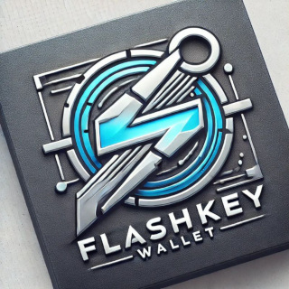

# FlashKey_Wallet
**FlashKey Wallet is a non-custodial wallet designed for the secure storage of XRP and XLM assets.**




## Disclaimer

**FlashKey** is an open-source tool, and while we aim to provide a secure and reliable solution for crypto asset storage, **users are solely responsible for the safekeeping of their private keys and assets**.

- **No liability**: Developers and contributors are not liable for any loss or theft of funds. FlashKey is designed to provide users with full control over their crypto assets, but the responsibility to store and safeguard private keys rests entirely with the user.
- **Risks of Bugs**: As with any open-source software, there may be bugs, vulnerabilities, or unforeseen issues. By using this software, you acknowledge and accept the risks involved.
- **Backup and Recovery**: It is crucial to regularly back up your keys and recovery information. FlashKey does not store or back up private keys, so if you lose access to your keys, you may lose access to your funds.

---

## Key Principles of the FlashKey Concept:

1. **Physical Security**  
   Private keys are stored on separate flash drives or individual files, reducing the risk of leaks from network attacks.

2. **Decentralized Storage**  
   Assets are distributed across multiple wallets (addresses) to minimize risks.

3. **Privacy**  
   Keys are generated using a live CD/USB, leaving no digital footprint.

4. **Minimalism**  
   Open-source scripts and interfaces allow users to control their assets without relying on complicated software.

5. **Convenience**  
   A flash drive becomes a universal tool, ready to use at any moment.

---
<!--Installation-->
# Installation (Linux)

To ensure maximum security, I **highly recommend** performing this installation in **Live USB mode**. The best choice for this is **Manjaro XFCE**—it's lightweight, fast, and perfect for the task.

## Preparing the Environment

1. **Boot into Manjaro XFCE Live USB.**  
   If you haven't created one yet, you can use tools like **Rufus** (Windows) or **dd** (Linux) to write the ISO to a USB drive.

2. **Insert another empty USB flash drive.**  
   This will be your secure storage for the FlashKey_Wallet.

3. **Open the flash drive in the file manager and open a terminal in this directory.**  
   (For example, right-click inside the flash drive and select "Open in Terminal").  
   This is important! The terminal will open with the **flash drive as the current working directory**, so everything you install will go directly there.

## Installing the Wallet

Now, with the setup ready, follow these steps:

1. **Clone the repository:**  
   ```bash
   git clone https://github.com/FlashKeyPro/FlashKeyWallet.git
   ```  

2. **Navigate to the FlashKeyWallet directory:**  
   ```bash
   cd FlashKeyWallet
   ```  

3. **Create a virtual environment:**  
   ```bash
   python -m venv virt
   ```  

4. **Activate the virtual environment:**  
   ```bash
   source virt/bin/activate
   ```  

5. **Install dependencies:**  
   ```bash
   pip install xrpl-py
   pip install stellar-sdk
   ```  

6. **Run the wallet script:**  
   ```bash
   python FlashKey.py
   ```  

Now your wallet is up and running **directly from the USB drive**, keeping it secure and isolated from your main system. 🚀


FlashKey is not just a technology — it’s a culture of decentralized and secure storage that can attract a wide range of supporters in the crypto world. 🌟
